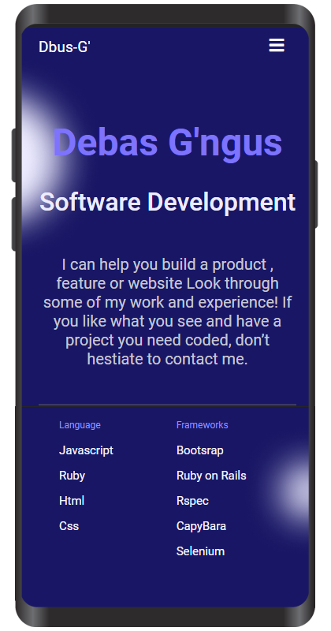

# Portfolio: Desktop and Mobile Version

>The portfolio project is my website which contains my first capstone project Expo Book Fair and Awesome Book project, and is also responsive for all screen sizes.

### Desktop ScreenShot 

### Mobile ScreenShot 

### Built With

- HTML5
- CSS3
- JS
- vscode
- Figma

### Live Demo

[Visit Live Demo](https://debas-31.github.io/dbus-portfolio/)

### Install

To get a local copy up and running follow these simple example steps.
- Open terminal
- Clone this project by the command `git clone https://github.com/Debas-31/dbus-portfolio.git`
- `cd repository_name` folder
- Open `index.html` in your local browser or using Live Server in Visual Studio Code.

👤 **Debas Gebreslasie**

- [GitHub](https://github.com/Debas-31)
- [Twitter](https://twitter.com/DEBSH76956492)
- [LinkedIn](https://www.linkedin.com/in/debas-gebrengus)

### 🤝 Contributing

Contributions, issues, and feature requests are welcome!

Feel free to check the [issues page](https://github.com/Debas-31/dbus-portfolio/issues).

### Show your support

Give a ⭐️ if you like this project!

### Acknowledgments
- Github

## 📝 License

This project is [MIT](https://github.com/Debas-31/dbus-portfolio/blob/Project-1-Setup-and-mobile-version-skeleton/MIT.md) licensed.
