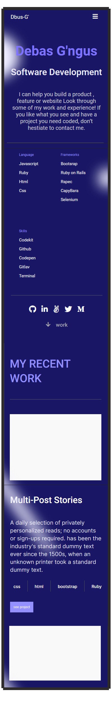

# Portfolio: mobile version

>This project demonstrated the Milestone-two on the mobile version.  
The aim of this project to parse a Figma design to create an awesome UI using flexbox and grid layout with the standard setup 
while doing the best practices (Linter, Github Flow, Professional commits, pull request and documentation)

### Built With

- HTML5
- CSS3

### Live Demo

[Visit the Live Demo](https://debas-31.github.io/dbus-portfolio/)

### Install

To get a local copy up and running follow these simple example steps.
- Open terminal
- Clone this project by the command `git clone URL/repository_name.git`
- `cd repository_name` folder
- Open `index.html` in your local browser or using Live Server in Visual Studio Code.
### Author1

👤 **Debas Gebreslasie**

- [GitHub](https://github.com/Debas-31)
- [Twitter](https://twitter.com/DEBSH76956492)
- [LinkedIn](https://www.linkedin.com/in/debas-gebrengus)

### Author2
  
  👤 **Meqdam Al-qudah**

- [GitHub](https://github.com/MeqdamAlqudah)
- [Twitter](https://twitter.com/MeqdamQudah)
- [LinkedIn](https://www.linkedin.com/in/meqdam-al-qudah-7514a21b5)

### 🤝 Contributing

Contributions, issues, and feature requests are welcome!

Feel free to check the [issues page](https://github.com/Debas-31/dbus-portfolio/issues).

### Show your support

Give a ⭐️ if you like this project!

### Acknowledgments
- Figma community

## 📝 License

This project is [MIT](https://github.com/Debas-31/dbus-portfolio/blob/Project-1-Setup-and-mobile-version-skeleton/MIT.md) licensed.